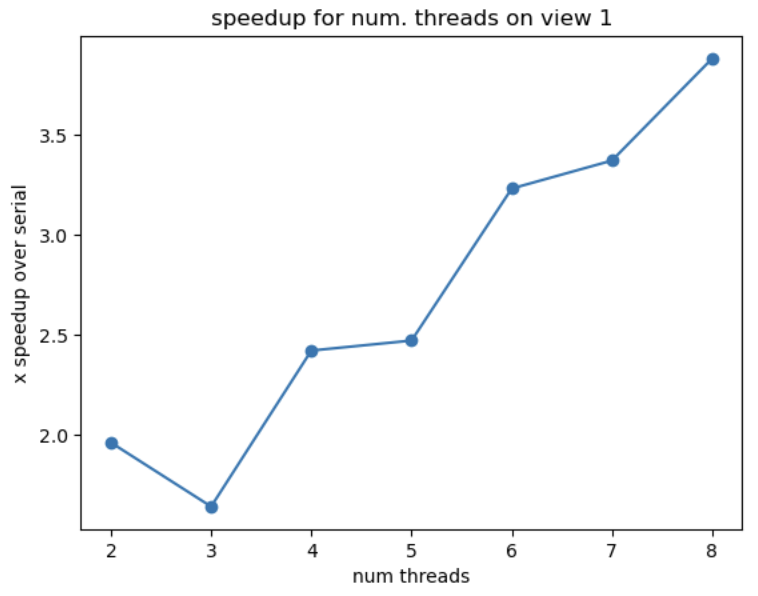
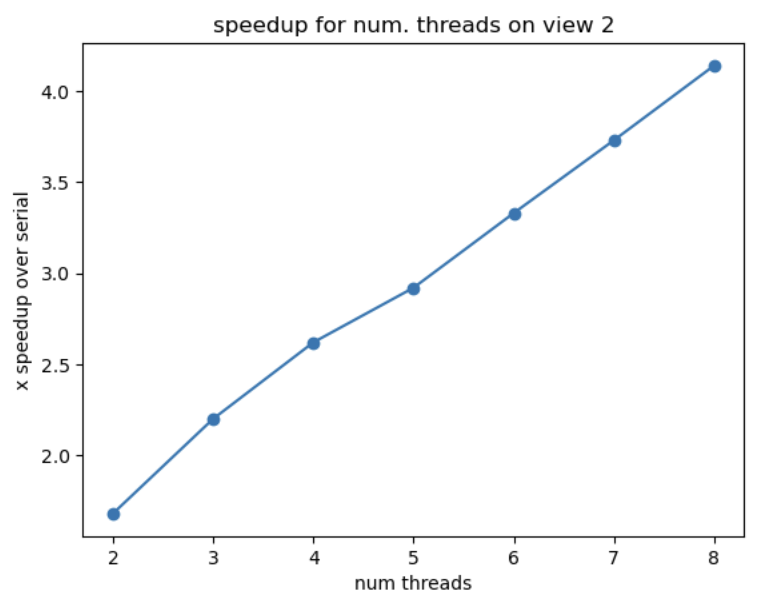

## Program 1

We plot a graph of speedup compared to the reference sequential implementation as a function of the number of threads used for view 1. 

We find that speedup is not fully linear in the number of threads used. For example, the speedup using 3 threads is slower than 
would be expected if it was linear. This is because the amount of computations for `mandelbrot()` is not evenly distributed across the 
three threads. 
Specifically, when using three threads, the middle section would have more iterations because its pixels end up having relatively 
higher values, and this is a result of splitting the image horizontally for the threads. 
When we compare view 2, we find that the plot of speedup vs. num threads is roughly linear, which is likely because the figure has 
roughly similar pixel values throughout (and is not so obviously different horizontally). 

We then measured the amount of time each thread requires to complete its work. We found that the times for each thread were pretty 
dissimilar: for example, for three threads, the times per thread were `[0.103827, 1.07242, 1.23648]` seconds. 
This supports that the partitioning of the image simply in horizontal threads is not efficient. 

We modified the mapping of work to the threads to achieve a greater speedup. Instead of chunking, for a `n` thread implementation, we 
essentially assigned every `n`-th row to each worker. So, thread 0 would get rows `0, n, 2n, ...` and thread 1 would get 
rows `1, 1+n, 1+2n, ...` and so on. This meant there were fewer "full black chunks" or "full white chunks" that made the load imbalanced
between threads. Specifically, our implementation had a loop like: 

`for(int row = thread_id; row < height; row += num_threads)`

to assign rows to threads. 

The final 8-thread speedup was **7.28x**. For 16 threads, we get a speedup of **7.15x**. The performance is not greater than 
running with 8 threads. This is because our processor has four cores with two hyper-threads each, so we cannot run 16 processes 
in parallel anyways. 

## Program 2

| `VECTOR_WIDTH` | vector utilization | 
| :---: | :---: | 
|     2      |      92.4% |
|      4      |      90.8% |
|      8      |      89.9% |
|     16      |      89.5%  |

Vector utilization decreases as `VECTOR_WIDTH` changes. In our implementation, we loop through multiplies up to the maximum exponent 
in the current vector. When the vector width is larger, this results in more amount of multiplies even for smaller exponents in the chunk. 
For example, if one chunk of exponents is `100 2 2 2`, then a vector chunk of 2 is better than a vector chunk of 4. 

## Program 3

### Part 1 
For view 1, the speedup we get is 5.06x using ISPC, and for view 2, the speedup we get is 4.33x using ISPC.

The maximum speedup we would expect from these CPUs would be 8x, because they do eight-wide SIMD vector instructions, meaning 
the values for 8 pixels could be computed at once. 

However, we do not get the maximum speedup, most likely due to different number of iterations of the for loop in the `mandel()` 
function for different elements in each gang. We know that all elements in the 8-wide vector need to execute to completion, which means 
each execution is bottlenecked by the slowest element (before the next gang can be computed). 

We can confirm this with the difference between image 1 and 2 --- there is more of a speedup with view 1, likely because there are more 
chunks of consecutive pixels that have similar values (num. of loops in `mandel()`), versus in view 2, the densities are more spread out and
less balanced within one vector. 

(The parts of the image that present challenges for SIMD execution would be 8 consecutive pixels that have different end values / number 
of loops in `mandel()`.)

### Part 2
1. The speedup is 9.87x using task ISPC, which was 1.95x speedup over the version without tasks. 
2. We change the number of tasks the code creates from 2 to 16, which gives a 32.18x speedup over the sequential version of the code. 
We chose 16 tasks because **[ TODO ]**. (We found with 16 and 32 tasks, there was a similar speedup.)

TODO * Try non- powers of 2

#### Extra Credit: 
What are differences between the thread abstraction (used in Program 1) and the ISPC task abstraction?
In both cases, there are a limited number of hardware threads (8 threads across 4 cores with 2 threads each, in this case). With threads, the OS will spend a lot of time context switching between 10000 software threads scheduled over 8 hardware threads - this involves pushing registers onto the stack and popping them. Overall, there is a lot of software OS overhead. With the ISPC tasks, there might be 10000 tasks to do, but they get compiled down to execute on up to SIMD-width data in parallel across gangs. The usage of SIMD and gangs divides the number of total instruction fetch/decode streams by the SIMD width. Plus, ISPC doesn't launch all the possible tasks at once but rather maintains the pending tasks in a queue, and waits for a hardware thread to free up before executing the next ISPC gang.

## Program 4

1. The ISPC implementation speedup for single CPU core (no tasks) is 4.37x. 
The ISPC implementation speedup when using all cores (with tasks) is 31.65x. 
The speedup due to SIMD parallelization is 4.37x. 
The speedup due to multi-core parallelization 7.24x. 

2. The input we choose is if each element in values is `2.99999`. 
The resulting speedup is 6.83x from ISPC, and 46.66x from task ISPC. 
The modification improves SIMD speedup. This is because every number will require lots of iterations to converge, but 
every element in the vector would require the same (large) number of iterations, and they would converge at once. 
There is not much of a speedup for multi-core (which is 46.66/6.83 = 6.83 compared to 7.24) because **[ TODO ]**

3. The input we choose is if all the elements in values is 1, except every 8th element is `2.78`. (**TODO: which we tuned?**)
The resulting speedup is 0.84x from ISPC, and 5.09x from task ISPC. 
We chose this input if we add a longer iteration number every 8th element, this forces the ISPC vector to take additional iterations
for all the other elements which are not necessary, and in the sequential implementation, those other elements would converge very 
quickly so there is not much of a difference. 

TODO * for q3, go with 2.99999 for now because it's easier to explain

## Program 5

The output of the program is

`[saxpy ispc]:           [11.294] ms     [26.387] GB/s   [3.542] GFLOPS`

`[saxpy task ispc]:      [10.734] ms     [27.765] GB/s   [3.727] GFLOPS`

There is 1.05x speedup from using ISPC with tasks, so there was not a large benefit to using tasks. 

We believe that this is due to the program mostly being memory bottlenecked: The actual operation of `saxpy` is very simple (scalar
multiplication and addition) but would require moving two 20M-element vectors (along with the result vector). (This is similar to 
an example discussed in class.) 

Regardless of how the computation is parallelized, we cannot speed up the memory bandwidth, which we believe accounts for the majority 
of the time of the program, so we do not think it can be substantially improved. 

(remove) One experiment we tried was to setting `result[i] = 0` in both `saxpy_ispc` and `saxpy_ispc_task` (instead of actually running the 
scalar multiplication and addition). This would require doing the same amount of memory movement 

Our other hypothesis is that the ISPC implementation is already parallelized using threads. We tried changing the number of tasks from 
64 to 1, and found there was no speedup. This suggests that because of the `foreach` loops, each thread is already being used at high 
capacity. 

TODO: we should check

## Program 6

First, we timed the average number of seconds that each of the functions `computeAssignments()`, `computeCentroids()`, and `computeCost()` took in 
iterations of the loop. 

`computeAssignments: 0.301481`

`computeCentroids: 0.0923297`

`computeCost: 0.0440835`

We see that most of the time being spent in the code is in `computeAssignments()`, which is where we decided to focus our speedup. 

After some modifications: (not enough optimizing!)

`assign_comp: 0.0510605`

`centroids_comp: 0.0389844`

`cost_comp: 0.0703796`

`[Total Time]: 5656.665 ms`

TODO * Think about the order of the loops & which variable is the largest. Think about data reuse + caches when using k as outer loop and m as inner loop. data eviction; caches.
